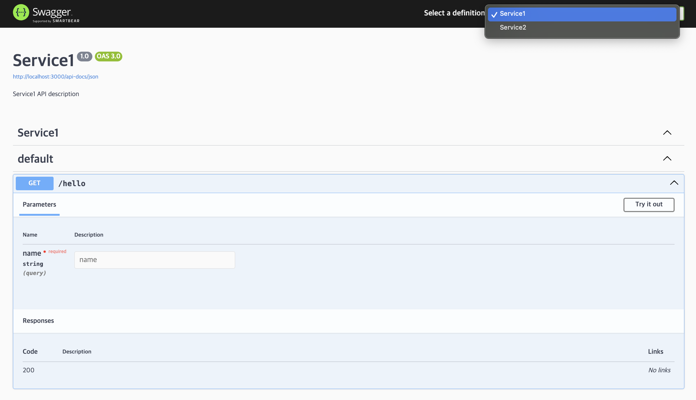

# msg-swagger-integration

Demo showcasing Swagger doc integration for microservices in a monorepo setup.

### Getting Started

You need to have `nvm` installed.

1. Setup runtime environment

```sh
nvm install # or the version specified in .nvmrc
corepack enable && corepack prepare # or install `packageManager` specified in package.json
```

2. Install dependencies

```sh
yarn install
```

3. Run microservices

```sh
yarn dev
```

4. Run docker compose (You need to have docker compose installed)

```sh
yarn swagger
```

5. Open http://localhost:8080/


